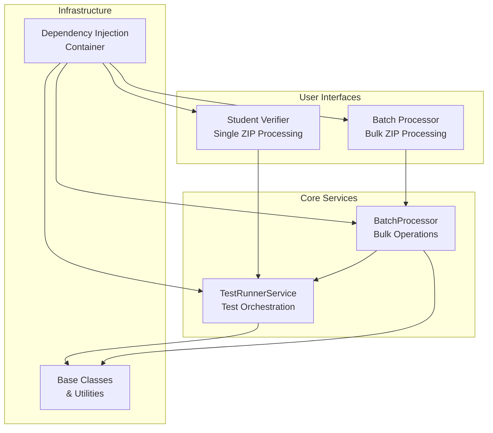
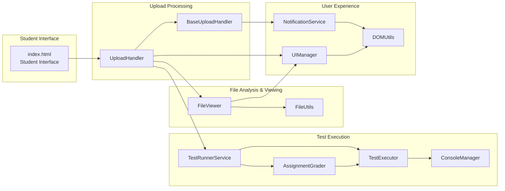
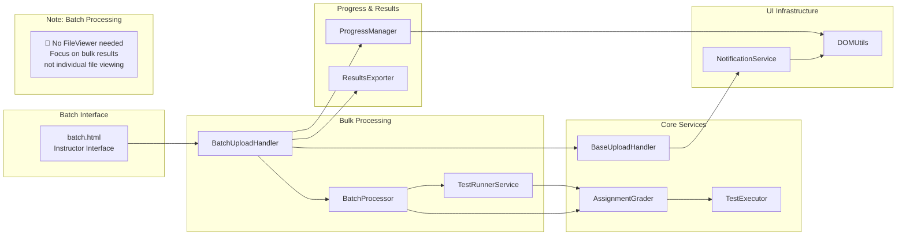
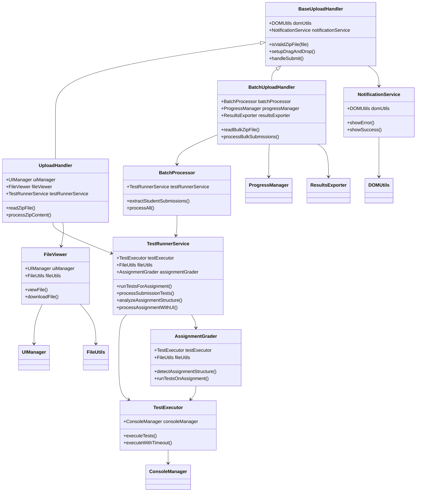
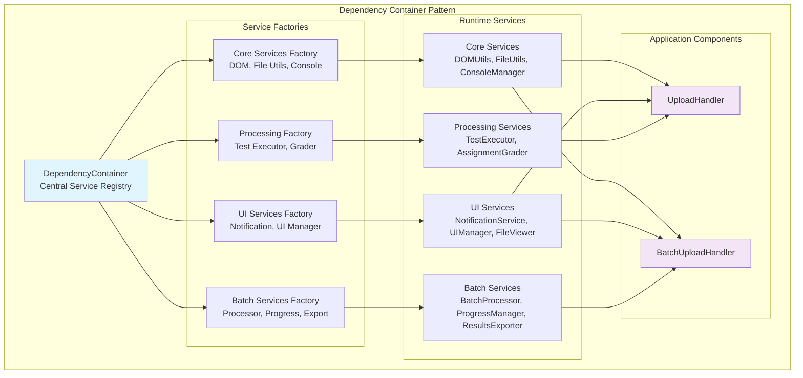
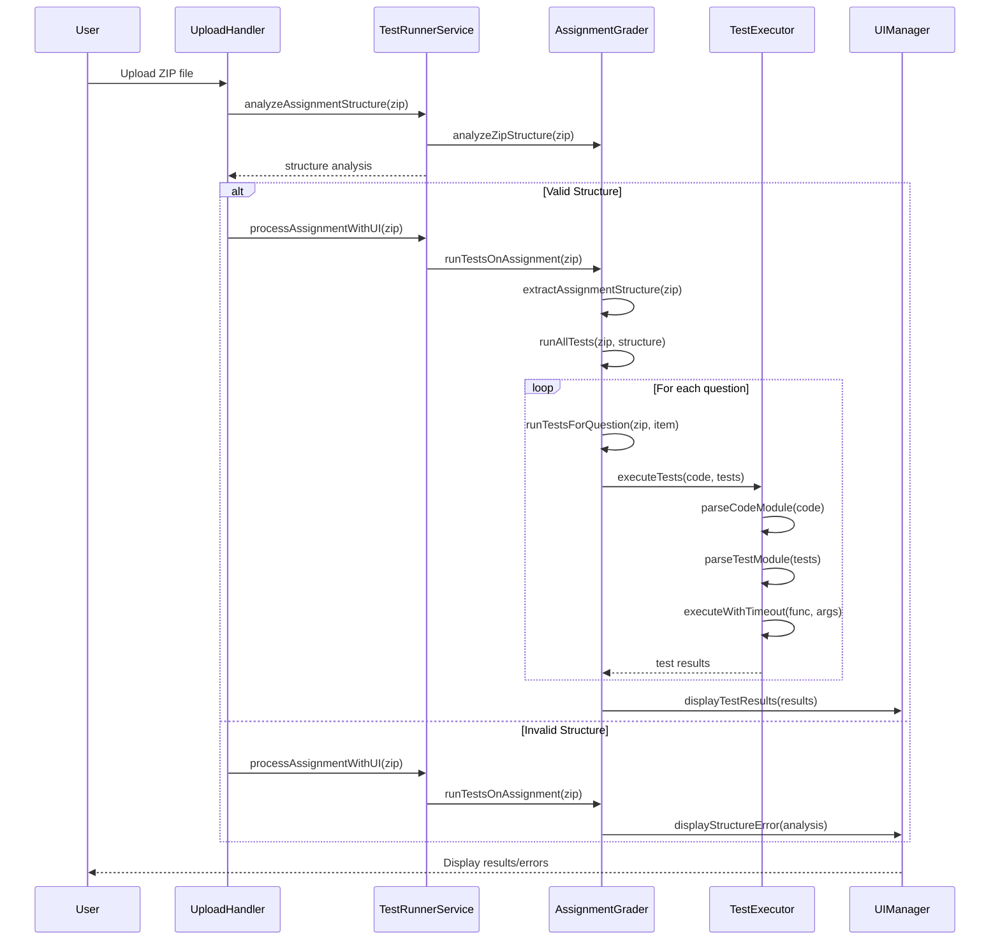
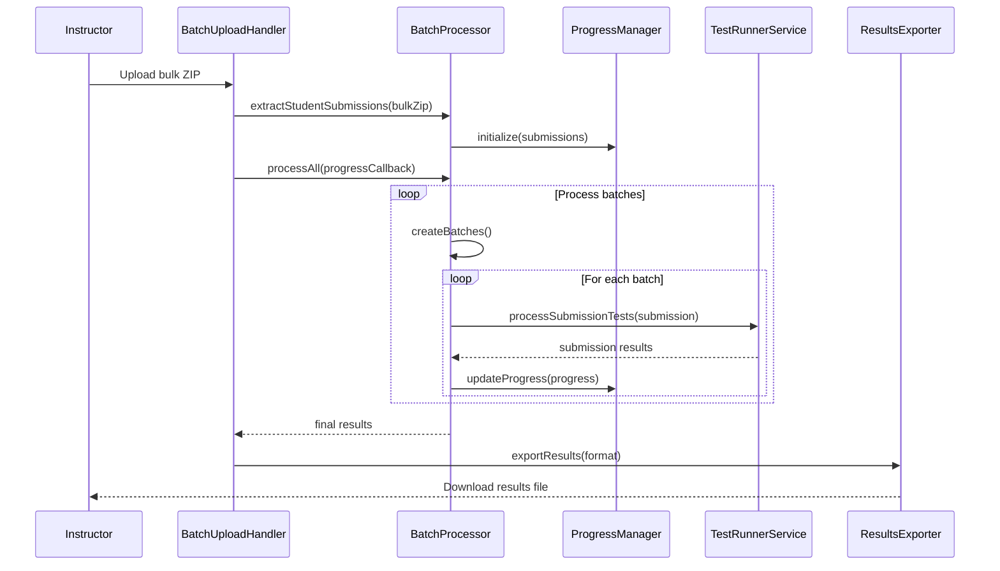

# ZIP Verifier - E2E Tests

## Overview

This comprehensive test suite provides end-to-end testing for the ZIP file verifier application using Playwright. The application includes both a **Student Verifier** tool and a **Batch Processor** for instructors.

## Setup

1. Install dependencies:

    ```bash
    npm install
    ```

2. Install Playwright browsers:
    ```bash
    npx playwright install
    ```

## Running Tests

### Local Development

```bash
# Run all tests (both student verifier and batch processor)
npm test

# Run tests with browser UI visible
npm run test:headed

# Debug tests step by step
npm run test:debug

# Start development server manually
npm run serve
```

### Individual Test Suites

```bash
# Run only student verifier tests
npx playwright test zip-verifier.spec.js

# Run only batch processor tests
npx playwright test batch-upload.spec.js
```

### CI/CD

```bash
# Run tests in CI mode with JUnit output
npm run test:ci
```

## Application Architecture

The application consists of two main interfaces with a sophisticated modular architecture built around dependency injection and service-oriented design patterns.

### System Overview



### Student Verifier Architecture



### Batch Processor Architecture



### Service Dependencies & Interactions



### Dependency Injection Container Architecture



### Test Execution Flow



### Batch Processing Flow


