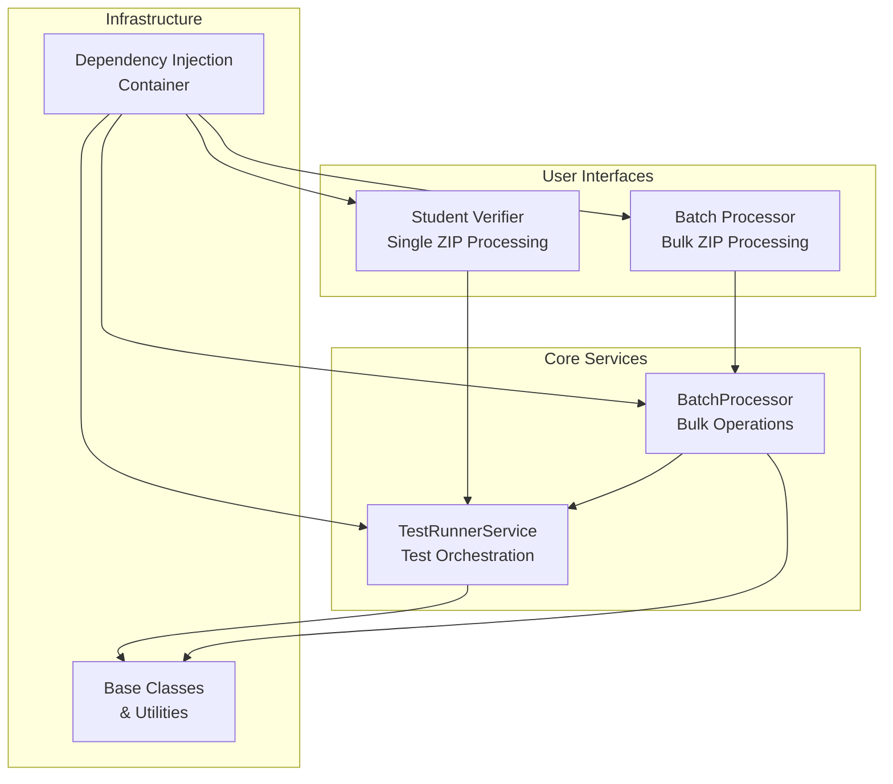
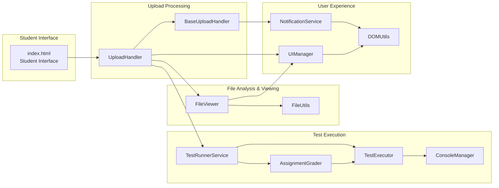
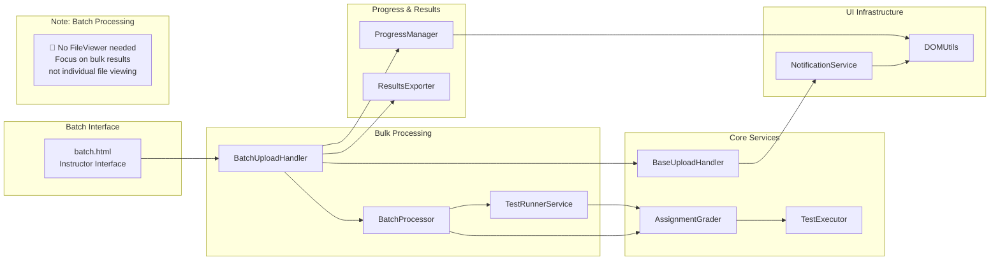
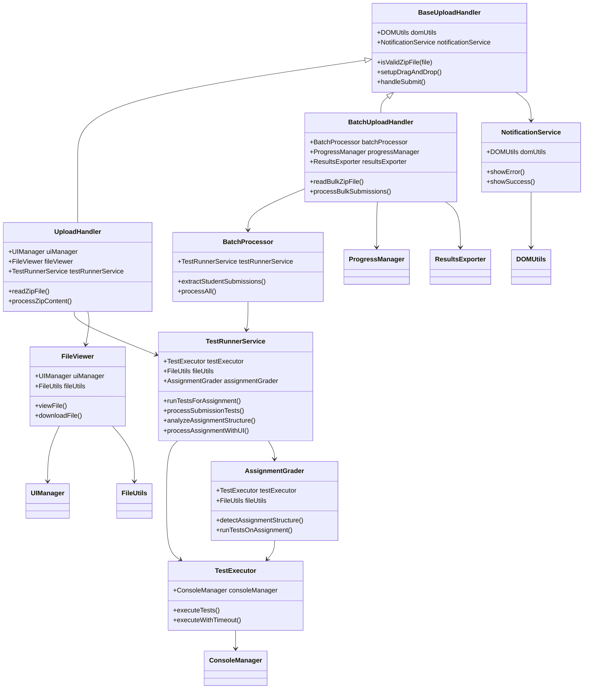
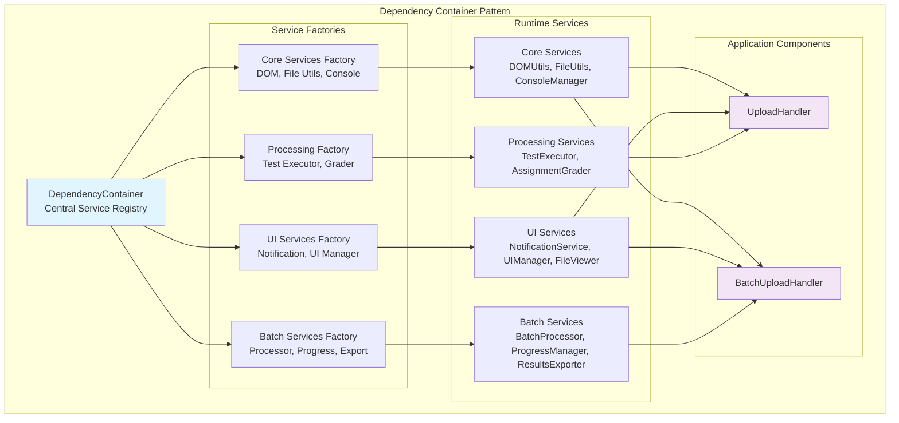
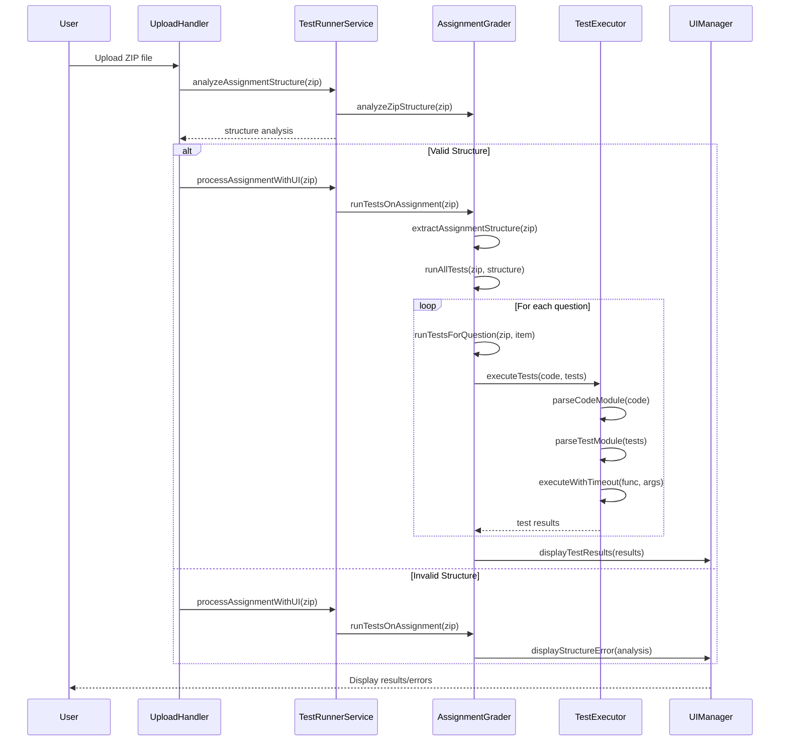
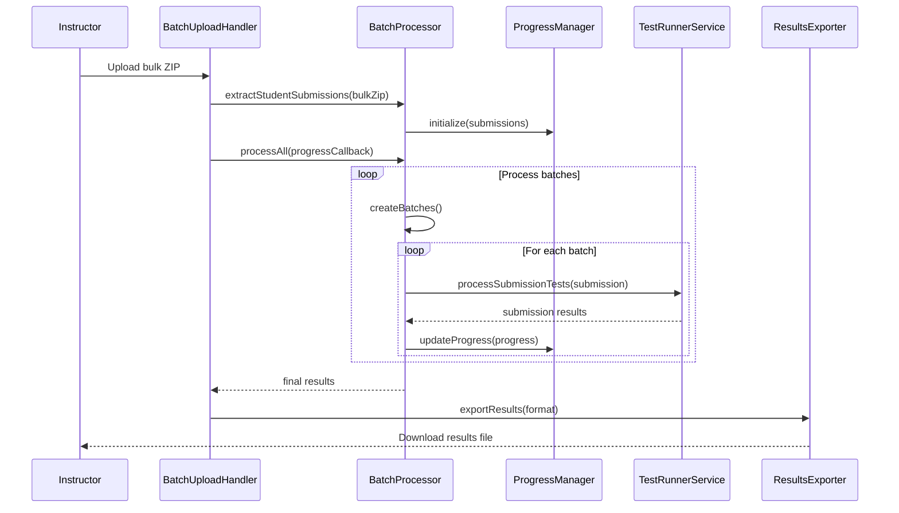

# ZIP Verifier - AI-Assisted Development Journey

[](https://sp-dit.github.io/zip-verifier/)

## Overview

This ZIP Verifier provides students a chance to verify their code submission before uploading to Brightspace. During FOP's MST/EST, students occasionally submit the wrong zip file (blank template instead of their completed code), resulting in automatic zero scores. This tool allows verification of zip files by executing code against test cases within the browser.

The application includes both a **Student Verifier** tool for individual submissions and a **Batch Processor** for instructors to handle multiple submissions efficiently. This comprehensive test suite provides end-to-end testing using Playwright.

## Setup

1. Install dependencies:

    ```bash
    npm install
    ```

2. Install Playwright browsers:
    ```bash
    npx playwright install
    ```

## Running Tests

### Local Development

```bash
# Run all tests (both student verifier and batch processor)
npm test

# Run tests with browser UI visible
npm run test:headed

# Debug tests step by step
npm run test:debug

# Start development server manually
npm run serve
```

### Individual Test Suites

```bash
# Run only student verifier tests
npx playwright test zip-verifier.spec.js

# Run only batch processor tests
npx playwright test batch-upload.spec.js
```

### CI/CD

```bash
# Run tests in CI mode with JUnit output
npm run test:ci
```

## Application Architecture

The application consists of two main interfaces with a sophisticated modular architecture built around dependency injection and service-oriented design patterns.

### System Overview



### Student Verifier Architecture



### Batch Processor Architecture



### Service Dependencies & Interactions



### Dependency Injection Container Architecture



### Test Execution Flow



### Batch Processing Flow



## AI-First Development Approach

The majority of this application was built through collaboration with **GitHub Copilot Agent mode powered by Claude Sonnet 4**, showcasing an advanced AI-assisted development workflow with sophisticated optimization techniques.

### Technical Stack & Architecture

-   **Frontend Only**: Complete client-side ZIP processing using JSZip library - no backend server required
-   **GitHub Pages**: Static site hosting for maximum accessibility
-   **GitHub Codespaces**: Development environment enabling Playwright testing when local machines have process spawning restrictions
-   **Playwright Testing**: Comprehensive E2E testing covering 13 automated scenarios
-   **CI/CD Pipeline**: Optimized GitHub Actions with smart browser caching (70% deployment time reduction)

---

### AI Collaboration Evolution

This project demonstrates a **two-week development journey** (Nov 25 - Dec 9, 2025) with 22+ commits, showcasing how AI collaboration evolves over time rather than being a one-shot solution.

**Development Timeline:**

-   **Week 1 (Nov 25-26)**: Initial prototype with core ZIP verification functionality
-   **Week 2 (Dec 4)**: Architecture reflection and extra folder detection improvements
-   **Week 3 (Dec 9)**: Major AI collaboration optimizations - 18 commits in a single day showing intensive AI-human collaboration

**AI Collaboration Techniques:**

#### 1. Model Context Protocol (MCP) Integration

-   **Context7 MCP**: Up-to-date documentation access for libraries and frameworks
-   **Playwright MCP**: Enabled Copilot to write and verify comprehensive test suites
-   **Browser MCP**: Real-time testing and debugging during development

#### 2. Smart Environment Detection

Implemented `process.env.AI` detection in Playwright configuration:

```javascript
reporter: process.env.CI ? 'github' : process.env.AI ? 'junit' : 'html';
```

This automatically switches to JUnit reporting when working with AI agents, improving the collaboration feedback loop.

#### 3. Mermaid.js Documentation Strategy

Created comprehensive architectural diagrams serving dual purposes:

-   **Human Documentation**: Visual system overview for developers
-   **AI Context**: Rich structural information for Copilot to understand codebase architecture

#### 4. Modular Architecture for AI Collaboration

Transitioned from single HTML file to sophisticated **dependency injection pattern**:

-   Individual service classes with clear responsibilities
-   Container-managed dependencies for better testability
-   Separate concerns between UI, business logic, and testing
-   Clean interfaces that AI can understand and extend

---

### Challenges & Solutions

#### 1. Context Window Management

**Problem**: Initially, Copilot generated everything in a single HTML file, creating:

-   Files too large for context windows
-   AI producing inconsistent code
-   Nearly impossible debugging

**Solution**: Refactored into modular classes with dependency injection, making codebase manageable for both humans and AI.

#### 2. Architectural Control

**Problem**: Copilot defaulted to global scope and static methods, hindering:

-   Unit testing in isolation
-   Dependency management
-   Code maintainability

**Solution**: Explicitly requested dependency injection patterns, resulting in cleaner and testable architecture.

#### 3. Cross-Platform Compatibility

**Problem**: AI initially unaware of different operating systems with different path separators (`/` vs `\`).

**Solution**: Implemented path normalization middleware to handle cross-platform file path differences.

---

### Key Accomplishments

#### AI-Suggested Feature Enhancements

Copilot proactively introduced valuable features beyond original scope:

-   File tree visualization with type-specific emojis
-   Comprehensive ZIP metadata display
-   Drag-and-drop upload interface
-   Real-time progress tracking for batch operations

#### Sophisticated Architecture

Despite being AI-generated, final architecture includes:

-   Dependency injection container
-   Service-oriented design
-   Comprehensive test coverage (13 automated scenarios)
-   Clean separation of concerns

#### AI Collaboration Optimizations

Developed techniques that significantly improved AI productivity:

-   Environment-aware configurations
-   Visual architecture documentation
-   Modular code organization
-   MCP-enhanced context awareness

---

### Lessons Learned

#### 1. Scope Control is Critical

Without clear boundaries, AI agents can pursue unnecessary tangents. Clear, focused instructions are essential through:

-   **Architectural Diagrams**: Mermaid.js flowcharts provide visual boundaries and expected component interactions
-   **Configuration Files**: Playwright config with environment detection establishes clear testing contexts
-   **Dependency Injection Patterns**: Explicit service boundaries prevent unwanted global dependencies
-   **Test Fixtures**: Pre-defined scenarios communicate expected behavior patterns without ambiguity

#### 2. Architecture-First Approach

Having conceptual overview before engaging AI is crucial. Starting small but establishing architectural principles early prevents:

-   **Unnecessary Dependencies**: Circular references and overly complex service relationships
-   **Tangled Code Structure**: Tightly coupled components without clear boundaries
-   **Difficult Maintenance**: Unexpected breakage when changing unrelated functionality

**Key Insight**: Visual documentation helps identify when AI-generated complexity needs human intervention and simplification.

#### 3. MCP Integration Benefits

Model Context Protocols dramatically improve AI capability by providing:

-   Real-time documentation access
-   Enhanced testing capabilities
-   Better understanding of complex workflows

---

### Technical Achievements

-   **Zero Backend Dependencies**: Fully client-side processing
-   **Cross-Platform Compatibility**: Handles Windows, macOS, and Linux submissions
-   **Comprehensive Testing**: 13 automated test scenarios covering edge cases
-   **CI/CD Optimization**: Smart browser caching reduces deployment time by 70%
-   **Accessibility**: Works across all major browsers without plugins

---

### Future Vision

#### Short-term Improvements

-   Enhanced user messaging to clarify verification vs submission
-   Better error messaging for edge cases
-   Mobile-responsive interface improvements

#### Long-term Enhancements

-   **Student Submission Tracking**: Monitor patterns and progress to identify students needing support
-   **Gamification Elements**: Achievement badges for clean code, early submissions, comprehensive testing
-   **User Management System**: Student profiles with submission history and performance analytics
-   **Learning Analytics Dashboard**: Instructor insights into common patterns, mistakes, and class progress
-   **Collaborative Learning Features**: Peer code review and study group formation based on complementary skills
