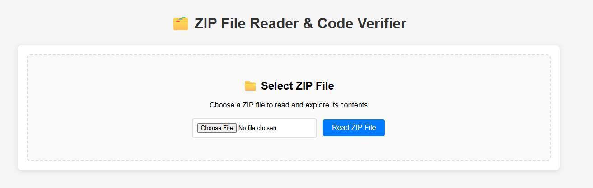
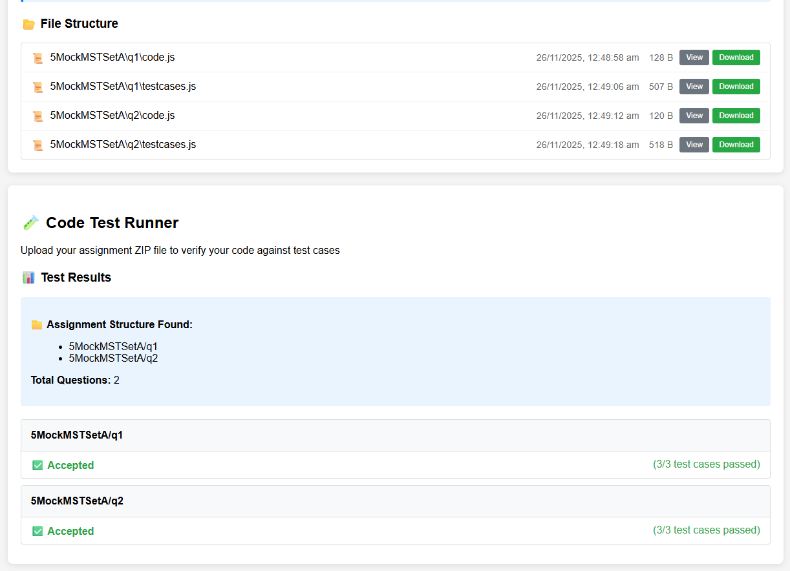
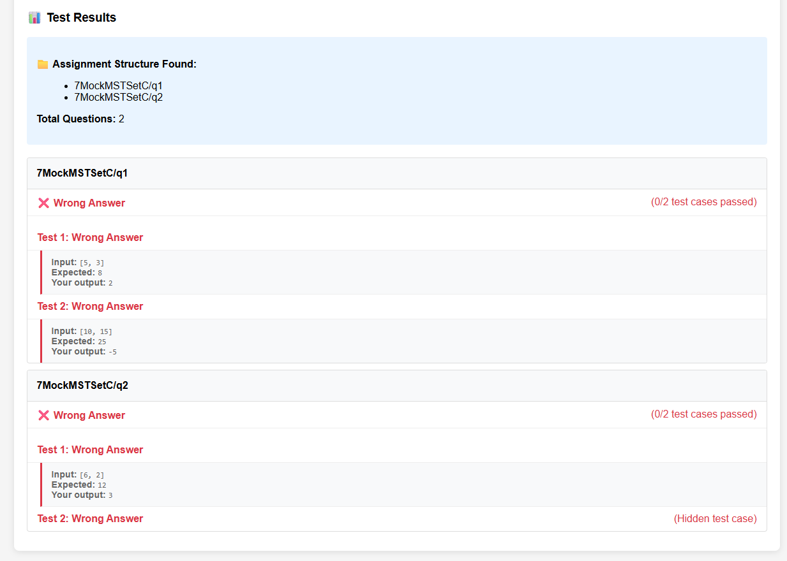

## Inspiration/Problem statement?

[Website](https://sp-dit.github.io/zip-verifier/)

During FOP's MST/EST, it is a common issue that students submit the wrong zip file.

That is, at the end of the test, they are supposed to zip up their code and submit on brightspace. In a few occasion, students wrongly submitted the original, blank, zip instead of the one with their code.

As per our current policy, doing so results in scoring 0 for the component with no second chance given.

## What it does

Hence, this tool seeks provide students a chance to first verify their submission. It allows them to upload their zip file and have their code executed against the test cases to verify their results before the proceed to submit on brightspace.

## How we built it

-   This app is purely frontend only. That is, the zip they submitted is unzipped and processed solely within their browser and not sent to any other backend server.
-   It utilizes [jszip](https://stuk.github.io/jszip/) to perform the zipping and unzipping
-   Hosting: As this is simply a frontend application, it is hosted on GitHub pages.
-   To test the correctness of the application, playwright script was written to simulate the submission of various type of zips, including those that works, those that work partially, those with incorrect file structure, codes that doesn't execute, and codes with infinite loop.
-   Whenever changes is pushed to GitHub, these test would run automatically, and deploy on if the tests passes.
-   Majority of the code were written by GitHub Copilot Pro, making use of Context7 MCP for up-to-date documentation, and Playwright MCP for copilot to test and verify the application.

## Challenges we ran into

-   At the start, Copilot generated the entire project within a single HTML file, this made it difficult for me to read and understand the code base. It also became too long for Copilot to fit the entire thing within the context window, causing it to give rubbish every once in a while. I decided instead of refactor the file into several smaller classes.

-   During the refactoring, as I did not give instruction on how I wanted it to be structured, copilot went with the classes approach, which honestly wasn't my preference but I didn't bother much with it. What I controlled though was that it initially referenced other classes through the global scope and through static methods. Recognizing that such setup is hard to test in isolation, I requested it change to a format that allows for dependency injection.

-   It was also unaware of the idea that students of different operating systems may be using the app, hence the slash (`/`) in the file path may differ (e.g. windows uses `/` whereas linux uses `\`). This breaks some of the scenarios, but thankfully it's easy enough to implement a intermediate processing step to convert all such slashes.

## Accomplishments that we're proud of

-   Not my accomplishment, but quite amazed (but annoyed at the same time), but the additional scope that copilot introduced was pretty helpful. For example, I didn't intended to display all the files in the zip, just execute it against the testcases and report the result was all I wanted. But it went ahead to introduce these feature, even including things like tagging a specific emoji to different file type.

-   But otherwise, was quite proud to finish a version of the app within 1 afternoon.

## What we learned

-   Scoping and controlling the set of task and context is important, if not the copilot will start going rouge and waste all the credits on unnecessary scopes.
-   But this also meant the need for clear conceptual/architectural overview of the application before we start providing instruction to the AI agent.
-   MCPs for the win!

## What's next for Untitled

-   Probably to improve the usability and clarity. One potential misunderstanding is that students may think that using this tool meant that it has been uploaded. Probably has to make clear that this is just to verify the zip.

## Media

